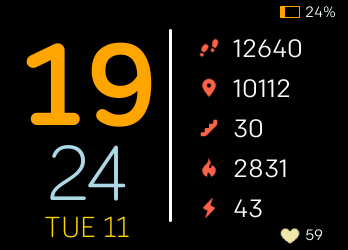
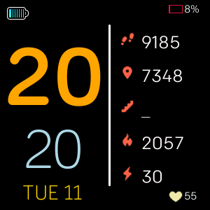
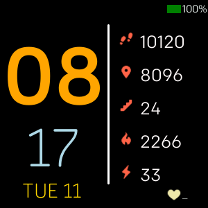
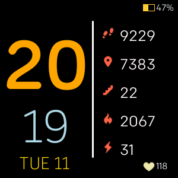

# Sleek Stats

The Sleek Stats is a simple but stats heavy clock face that brings all the information you need at one place. The Simplicity and user friendliness is at the core of this clock face. The clock face displays user activities with following details - 
  - Steps
  - Distance
  - Floors
  - Calories
  - Active Minutes
  - Heart Rate

The clock also shows the battery level indicator which keeps on changing the color to reflect the balance of the power.

### How about some looks of Sleek Stats?

Although, this clock-face is still in its initial phase and has a scope to be improved further. Please drop me an email at <nileshfbk123@gmail.com> to suggest improvements or report issues in the clock face. 